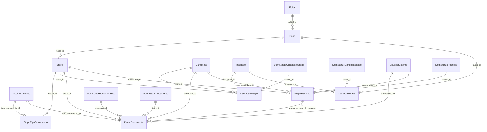
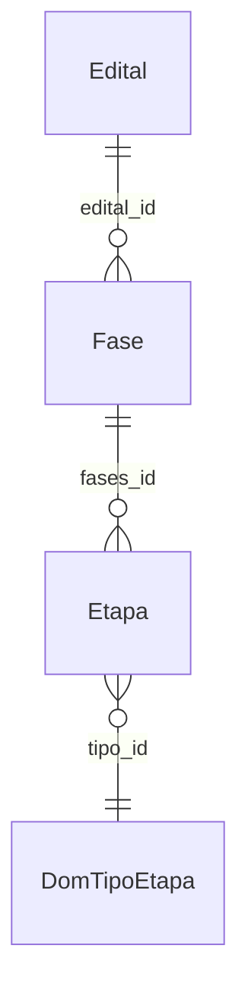
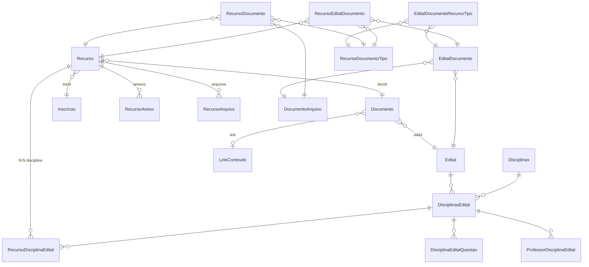
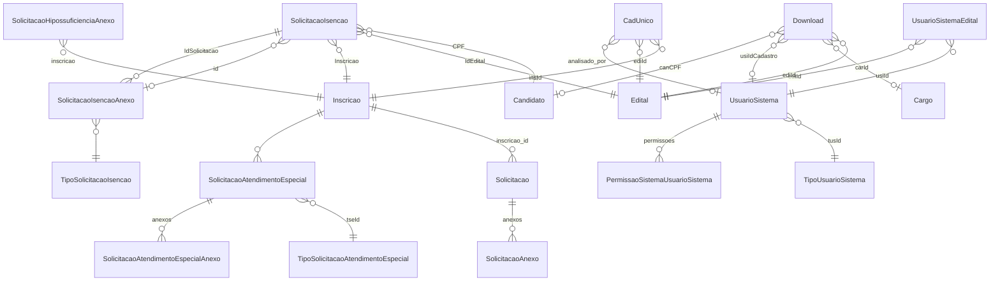

# Models e relações — IDECAN e IDIB

Documentação das entidades JPA em:

- `runtime/src/main/java/br/com/bio/registro/core/runtime/entities/idecan`
- `runtime/src/main/java/br/com/bio/registro/core/runtime/entities/idib`

Gerado a partir do código-fonte (mapeamentos ativos; relações comentadas no código estão marcadas como *planejadas*).

---

## Visão geral

| Aspecto | IDECAN | IDIB |
|--------|--------|------|
| DataSource / PU | `idecan` | `idib` |
| Classe base | `GenericEntityIdecan` → `PanacheEntityBase` | `GenericEntityIdib` → `PanacheEntityBase` |
| Pacote entities | `...entities.idecan.dbo` | `...entities.idib.dbo` |
| Domínios de fase/etapa | `dbo.faseDominio.*` (idecan) | Reutiliza parcialmente `idecan.dbo.faseDominio` (ex.: `DomTipoEtapa`) |
| Módulo fases/etapas completo | Sim (candidatos, documentos, recursos) | Parcial (apenas `Fase` e `Etapa`) |

Os dois bancos espelham o mesmo domínio de negócio de concursos (edital, inscrição, pagamento, recurso, solicitação). O IDECAN concentra o modelo novo de **fases/etapas**.

---

## Diagrama — núcleo compartilhado (Edital / Inscrição)

Relacionamentos ativos presentes em **ambos** (mesmo desenho, entidades no pacote do datasource correspondente).

```mermaid
erDiagram
    Edital ||--o{ Cargo : "tem"
    Edital ||--o{ BancoEdital : "tem"
    Edital ||--o{ LocalidadeProva : "tem"
    Edital ||--o{ Documento : "tem"
    Edital ||--o{ DisciplinasEdital : "tem"
    Edital }o--|| Status : "status"
    BancoEdital }o--|| Banco : "banco"
    BancoEdital ||--o| ConcursoBancoLogin : "bancoLogin"
    ConcursoBancoLogin }o--|| Edital : "edital"
    ConcursoBancoLogin }o--|| Banco : "banco"
    Cargo ||--o{ Localidade : "vagas/local"
    Localidade }o--|| Cidade : "cidade"
    Cidade }o--|| UF : "uf"
    Candidato }o--|| UF : "uf"
    Candidato }o--|| TipoEscolaridade : "escolaridade"
    Inscricao }o--|| Candidato : "canCPF"
    Inscricao }o--|| Localidade : "locId"
    Inscricao }o--|| LocalidadeProva : "lprId"
    Inscricao ||--o{ BoletoBancario : "boletos"
    Inscricao ||--o{ SolicitacaoAtendimentoEspecial : "SAE"
    Inscricao ||--o| InscricaoPCDLaudo : "laudoPcd"
    Inscricao ||--o| InscricaoSubJudice : "subJudice"
    InscricaoPCDLaudo }o--|| Candidato : "candidato"
    InscricaoPCDLaudo }o--|| Edital : "edital"
    PagTesouro }o--|| Inscricao : "inscricao"
```



---

## Diagrama — Módulo Fases / Etapas (IDECAN)



### IDIB (parcial)



> `DomTipoEtapa` em IDIB aponta para a entidade de domínio do pacote **idecan** (`idecan.dbo.faseDominio.DomTipoEtapa`). Os campos `status` / elegibilidade de `Etapa` e `status` de `Fase` existem no código **comentados** (planejados).

---

## Diagrama — Recursos e documentos do edital



---

## Diagrama — Solicitações e usuários



---

# 1. IDECAN — entidades

Pacote: `br.com.bio.registro.core.runtime.entities.idecan.dbo`  
Base: `GenericEntityIdecan`

## 1.1 Catálogo completo

| Entidade | Tabela | PK | Relacionamentos (ativos) |
|----------|--------|----|--------------------------|
| **Banco** | `Banco` | `banId` | — |
| **BancoEdital** | `BancoEdital` | `bedId` | M:1 → `Edital` (`ediId`); M:1 → `Banco` (`banId`); 1:1 → `ConcursoBancoLogin` |
| **BoletoBancario** | `BoletoBancario` | `bbaId` | M:1 → `Inscricao` (`insId`) |
| **BoletoBancarioDare** | `BoletoBancarioDare` | `id` | — (sem @ManyToOne) |
| **BoletoCaixa** | `BoletoCaixa` | `id` | — |
| **CadUnico** | `cad_unico` | `cadUnicoId` | M:1 → `Inscricao` (`insId`); M:1 → `Edital` (`ediId`); M:1 → `UsuarioSistema` (`analisado_por`) |
| **Candidato** | `Candidato` | `canCPF` | M:1 → `UF` (`ufId`); M:1 → `TipoEscolaridade` (`tesId`) |
| **CandidatoEtapa** | `candidato_etapa` | `id` | M:1 → `Candidato` (`candidato_id` → `canCPF`); M:1 → `Etapa` (`etapa_id`); M:1 → `DomStatusCandidatoEtapa` (`status_id`); M:1 → `Inscricao` (`inscricao_id`) |
| **CandidatoFase** | `candidato_fase` | `id` | M:1 → `Inscricao` (`inscricao_id`); M:1 → `Fase` (`fases_id`); M:1 → `DomStatusCandidatoFase` (`status_id`) |
| **Cargo** | `Cargo` | `carId` | M:1 → `Edital`; inverso em `Edital.cargos` |
| **Cidade** | `Cidade` | `cidId` | M:1 → `UF` (`ufId`) |
| **ConcursoBancoLogin** | `ConcursoBancoLogin` | `id` | M:1 → `Edital`; M:1 → `Banco` |
| **Cota** | `Cotas` | `id` | — |
| **DisciplinaEditalQuestao** | `DisciplinasEditaisQuestoes` | `id` | M:1 → `DisciplinasEdital` (`disciplinaEditalId`) |
| **Disciplinas** | `Disciplinas` | `id` | — |
| **DisciplinasEdital** | `DisciplinasEditais` | `id` | M:1 → `Edital` (`editalId`); M:1 → `Disciplinas` (`disciplinaId`) |
| **Documento** | `Documento` | `docId` | M:1 → `LinkConteudo`; M:1 → `Edital` (`ediId`) |
| **DocumentoArquivo** | `DocumentoArquivo` | `id` | — |
| **DocumentoInscricao** | `DocumentoInscricao` | `id` | — |
| **Download** | `Download` | `dowId` | M:1 → `Edital` (`ediId`); M:1 → `Cargo` (`carId`); M:1 → `UsuarioSistema` (`usiIdCadastro`); M:1 → `Candidato` (`canCPF`) |
| **DuaeInscricao** | `DuaeInscricao` | `id` | M:1 → `Inscricao` (`inscricao_id`) |
| **Edital** | `Edital` | `ediId` | M:1 → `Status` (`staId`); 1:N → `BancoEdital` (`bancos`); 1:N → `Cargo` (`cargos`) |
| **EditalDocumento** | `EditalDocumento` | `id` | M:1 → `Edital` (`edital_id`); M:1 → `DocumentoArquivo` (`documento_arquivo_id`) |
| **EditalDocumentoRecursoTipo** | `EditalDocumentoRecursoTipo` | `id` | M:1 → `EditalDocumento`; M:1 → `RecursoDocumentoTipo` |
| **Etapa** | `etapa` | `id` | M:1 → `Fase` (`fases_id`). *Planejado (comentado):* `DomTipoEtapa`, `DomStatusEtapa`, auto-ref elegibilidade |
| **EtapaDocumento** | `etapa_documento` | `id` | M:1 → `Candidato` (`candidato_id` → `canCPF`); M:1 → `Etapa`; M:1 → `TipoDocumento`; M:1 → `DomContextoDocumento`; M:1 → `DomStatusDocumento`; M:1 → `UsuarioSistema` (`analisado_por`) |
| **EtapaRecurso** | `etapa_recurso` | `id` | M:1 → `Candidato`; M:1 → `Etapa`; M:1 → `DomStatusRecurso`; M:1 → `UsuarioSistema` (`respondido_por`); **N:N** → `EtapaDocumento` via `etapa_recurso_documento` (`recurso_id` / `documento_id`) |
| **EtapaTipoDocumento** | `etapa_tipo_documento` | `@EmbeddedId` (`etapaId` + `tipoDocumentoId`) | M:1 → `Etapa`; M:1 → `TipoDocumento`; flag `obrigatorio` |
| **Fase** | `fases` | `id` | M:1 → `Edital` (`edital_id`). UK: `(edital_id, ordem)`. *Planejado:* `DomStatusFase` |
| **FotoCandidato** | `CandidatoFoto` | `id` | — |
| **Inscricao** | `Inscricao` | `insId` | M:1 → `Candidato` (`canCPF`); M:1 → `Localidade` (`locId`); M:1 → `LocalidadeProva` (`lprId`); 1:N → `BoletoBancario`; 1:N → SAE; 1:1 → `InscricaoPCDLaudo`; 1:1 → `InscricaoSubJudice` |
| **InscricaoPCDLaudo** | `InscricaoPCDLaudo` | `iplId` | 1:1 → `Inscricao` (`insId`); M:1 → `Candidato`; M:1 → `Edital` |
| **InscricaoSubJudice** | `InscricaoSubJudice` | `id` | 1:1 → `Inscricao` |
| **LinkConteudo** | `LinkConteudo` | `lcoId` | — |
| **Localidade** | `Localidade` | `locId` | M:1 → `Cargo` (`carId`); M:1 → `Cidade` (`cidId`) |
| **LocalidadeProva** | `LocalidadeProva` | `lprId` | M:1 → `Edital` (`ediId`) |
| **Modalidade** | `modalidades` | `id` | — |
| **PagTesouro** | `PagTesouro` | `id` | M:1 → `Inscricao` (`insId`) — base `PanacheEntityBase` |
| **PermissaoSistemaUsuarioSistema** | `PermissaoSistemaUsuarioSistema` | composto (`usuarioSistema` + …) | M:1 → `UsuarioSistema` (`usiId`) |
| **Pix** | `pix` | `Id` | — |
| **PixSefMg** | *(sem @Table name explícito simples)* | `id` | — |
| **ProfessorDisciplinaEdital** | `ProfessoresDisciplinasEditais` | `id` | M:1 → `DisciplinasEdital` |
| **Recurso** | `Recurso` | `recId` | M:1 → `Documento` (`docId`); M:1 → `Inscricao` (`insId`); 1:N → `RecursoAnexo`, `RecursoArquivo` |
| **RecursoAnexo** | `RecursoAnexo` | `ranId` | M:1 → `Recurso` (`recId`) |
| **RecursoArquivo** | `RecursoArquivo` | `id` | M:1 → `Recurso` (`RecursoId`) |
| **RecursoDisciplinaEdital** | `RecursosDisciplinasEditais` | `id` | M:1 → `Recurso`; M:1 → `DisciplinasEdital` |
| **RecursoDocumento** | `RecursoDocumento` | `id` | M:1 → `Recurso`; M:1 → `DocumentoArquivo`; M:1 → `RecursoDocumentoTipo` |
| **RecursoDocumentoTipo** | `RecursoDocumentoTipo` | `id` | — |
| **RecursoEditalDocumento** | `RecursoEditalDocumento` | `id` | M:1 → `Recurso`; M:1 → `EditalDocumento`; M:1 → `RecursoDocumentoTipo` |
| **SantanderBankNumberSeq** | seq | `id` | utilitário / sequência |
| **SantanderBoleto** | boleto santander | `id` | — |
| **SantanderNsuSeq** | seq | `covenantCode` | utilitário / sequência |
| **Solicitacao** | `solicitacao` | `id` | M:1 → `Inscricao` (`inscricao_id`); 1:N → `SolicitacaoAnexo`; enums `TipoSolicitacao`, `StatusSolicitacao` |
| **SolicitacaoAnexo** | `SolicitacaoAnexo` | `id` | M:1 → `Solicitacao` |
| **SolicitacaoAtendimentoEspecial** | `SolicitacaoAtendimentoEspecial` | `saeId` | M:1 → `Inscricao` (`insId`); M:1 → tipo SAE; 1:N anexos |
| **SolicitacaoAtendimentoEspecialAnexo** | `SolicitacaoAtendimentoEspecialAnexo` | `saaId` | M:1 → SAE |
| **SolicitacaoHipossuficienciaAnexo** | `SolicitacaoHipossuficienciaAnexo` | `id` | M:1 → `Inscricao` |
| **SolicitacaoIsencao** | `SolicitacaoIsencao` | `id` | M:1 → anexo / `Candidato` / `Edital` / `Inscricao` |
| **SolicitacaoIsencaoAnexo** | `SolicitacaoIsencaoAnexo` | `id` | M:1 → `SolicitacaoIsencao`; M:1 → `TipoSolicitacaoIsencao` |
| **Status** | `Status` | `staId` | — (lookup edital) |
| **TipoDocumento** | `tipo_documento` | `id` | — (módulo etapas) |
| **TipoEscolaridade** | `TipoEscolaridade` | `tesId` | — |
| **TipoPermissaoSistema** | `TipoPermissaoSistema` | `tpsId` | — |
| **TipoSolicitacaoAtendimentoEspecial** | `TipoSolicitacaoAtendimentoEspecial` | `tseId` | — |
| **TipoSolicitacaoIsencao** | `TipoSolicitacaoIsencao` | `id` | — |
| **TipoUsuarioSistema** | `TipoUsuarioSistema` | `tusId` | — |
| **UF** | `UF` | `ufId` | — |
| **UsuarioSistema** | `UsuarioSistema` | `usiId` | M:1 → `TipoUsuarioSistema`; 1:N → permissões |
| **UsuarioSistemaEdital** | `UsuarioSistemaEdital` | `id` | M:1 → `UsuarioSistema`; M:1 → `Edital` |

### Classes auxiliares (não-@Entity de domínio ou embeddable)

| Classe | Uso |
|--------|-----|
| `EtapaTipoDocumentoId` | `@Embeddable` — PK composta etapa + tipo documento |
| `PermissaoSistemaUsuarioSistemaId` | ID composto de permissão |

### Views

| Entidade | Tabela/View |
|----------|-------------|
| `VwInscricao` | `vw_inscricoes_full_data` |
| `VwInscricaoEnsalamento` | `vw_inscricao_ensalamento` |
| `VwLocalidadeCargoEdital` | `vw_localidade_cargo_edital` |

DTOs em `dbo.views.models`: `CandidatoVWDTO`, `CargoVWDTO`, `EditalVWDTO`, `InscricaoVWDTO`, `LocalidadeVWDTO`.

### Enums (`idecan.enums`)

| Enum | Uso |
|------|-----|
| `TipoSolicitacao` | `Solicitacao.tipoSolicitacao` |
| `StatusSolicitacao` | `Solicitacao.status` |
| `StatusPixEnum` | Pix |
| `SituacaoSae` | SAE |

---

## 1.2 Domínios de fase (`faseDominio`)

Superclasse: `DominioBase` (`@MappedSuperclass`) — campos `id`, `valor` (código de negócio), `descricao`.

| Entidade | Tabela | Usada por (ativo) |
|----------|--------|-------------------|
| **DomContextoDocumento** | `dom_contexto_documento` | `EtapaDocumento.contexto` |
| **DomStatusCandidatoEtapa** | `dom_status_candidato_etapa` | `CandidatoEtapa.status` (*e elegibilidade de Etapa – planejado*) |
| **DomStatusCandidatoFase** | `dom_status_candidato_fase` | `CandidatoFase.status` |
| **DomStatusDocumento** | `dom_status_documento` | `EtapaDocumento.status` |
| **DomStatusEdital** | `dom_status_edital` | *(disponível; não ligada em Edital no JPA atual — Edital usa `Status`)* |
| **DomStatusEtapa** | `dom_status_etapa` | *planejado em `Etapa.status`* |
| **DomStatusFase** | `dom_status_fase` | *planejado em `Fase.status`* |
| **DomStatusRecurso** | `dom_status_recurso` | `EtapaRecurso.status` |
| **DomTipoEtapa** | `dom_tipo_etapa` | *planejado em IDECAN `Etapa.tipo`*; **ativo** em IDIB `Etapa.tipo` |

---

## 1.3 Detalhe — módulo etapas (IDECAN)

### Cadeia principal

```
Edital 1──N Fase 1──N Etapa
                │
                ├── N CandidatoFase (por inscrição)
                └── N Etapa
                        ├── N EtapaTipoDocumento (tipos aceitos)
                        ├── N CandidatoEtapa
                        ├── N EtapaDocumento (uploads do candidato)
                        └── N EtapaRecurso (com N:N EtapaDocumento)
```

### `EtapaDocumento` (exemplo de referência)

| FK / campo | Coluna | Tipo alvo |
|------------|--------|-----------|
| `candidato` | `candidato_id` → `canCPF` | `Candidato` |
| `etapa` | `etapa_id` | `Etapa` |
| `tipoDocumento` | `tipo_documento_id` | `TipoDocumento` |
| `contexto` | `contexto_id` | `DomContextoDocumento` |
| `status` | `status_id` | `DomStatusDocumento` |
| `analisadoPor` | `analisado_por` | `UsuarioSistema` |
| arquivos | `arquivo_nome`, `arquivo_url`, `mime_type`, `tamanho_bytes` | atributos |
| auditoria | `created_at`, `updated_at`, `analisado_em`, `motivo_rejeicao` | atributos |

### Join table N:N

| Tabela | Colunas | Lados |
|--------|---------|-------|
| `etapa_recurso_documento` | `recurso_id`, `documento_id` | `EtapaRecurso` ↔ `EtapaDocumento` |

---

# 2. IDIB — entidades

Pacote: `br.com.bio.registro.core.runtime.entities.idib.dbo`  
Base: `GenericEntityIdib`

## 2.1 Catálogo completo

| Entidade | Tabela | PK | Relacionamentos (ativos) |
|----------|--------|----|--------------------------|
| **Banco** | `Banco` | `banId` | — |
| **BancoEdital** | `BancoEdital` | `bedId` | M:1 → `Edital` (`ediId`); M:1 → `Banco` (`banId`); 1:1 → `ConcursoBancoLogin` |
| **BoletoBancario** | `BoletoBancario` | `bbaId` | M:1 → `Inscricao` (`insId`) |
| **BoletoBancarioDare** | `BoletoBancarioDare` | `id` | — |
| **BoletoCaixa** | `BoletoCaixa` | `id` | — |
| **CadUnico** | `cad_unico` | `cadUnicoId` | M:1 → `Inscricao`; M:1 → `Edital`; M:1 → `UsuarioSistema` |
| **Candidato** | `Candidato` | `canCPF` | M:1 → `UF`; M:1 → `TipoEscolaridade` |
| **Cargo** | `Cargo` | `carId` | M:1 → `Edital` |
| **Cidade** | `Cidade` | `cidId` | M:1 → `UF` |
| **ConcursoBancoLogin** | `ConcursoBancoLogin` | `id` | M:1 → `Edital`; M:1 → `Banco` |
| **DisciplinaEditalQuestao** | `DisciplinasEditaisQuestoes` | `id` | M:1 → `DisciplinasEdital` |
| **Disciplinas** | `Disciplinas` | `id` | — |
| **DisciplinasEdital** | `DisciplinasEditais` | `id` | M:1 → `Edital`; M:1 → `Disciplinas` |
| **Documento** | `Documento` | `docId` | M:1 → `LinkConteudo`; M:1 → `Edital` |
| **DocumentoArquivo** | `DocumentoArquivo` | `id` | — |
| **DocumentoInscricao** | `DocumentoInscricao` | `id` | — |
| **Download** | `Download` | `dowId` | M:1 → `Edital`; `Cargo`; `UsuarioSistema`; `Candidato` |
| **Edital** | `Edital` | `ediId` | M:1 → `Status`; 1:N `bancos`, `cargos` |
| **EditalDocumento** | `idib` (schema `dbo`) | `id` | M:1 → `Edital`; M:1 → `DocumentoArquivo` *(nome de tabela atípico no código atual)* |
| **EditalDocumentoRecursoTipo** | `EditalDocumentoRecursoTipo` | `id` | M:1 → `EditalDocumento`; M:1 → `RecursoDocumentoTipo` |
| **Etapa** | `etapa` | `id` | M:1 → `Fase` (`fases_id`); M:1 → **`DomTipoEtapa` (idecan)** (`tipo_id`). *Comentado:* status, elegibilidade |
| **Fase** | `fases` | `id` | M:1 → `Edital` (`edital_id`). UK `(edital_id, ordem)`. *Comentado:* `DomStatusFase` |
| **FotoCandidato** | `CandidatoFoto` | `id` | — |
| **Inscricao** | `Inscricao` | `insId` | Igual IDECAN: candidato, localidade, localidade prova, boletos, SAE, laudo, sub-júdice |
| **InscricaoPCDLaudo** | `InscricaoPCDLaudo` | `iplId` | 1:1 `Inscricao`; M:1 `Candidato`, `Edital` |
| **InscricaoSubJudice** | `InscricaoSubJudice` | `id` | 1:1 `Inscricao` |
| **LinkConteudo** | `LinkConteudo` | `lcoId` | — |
| **Localidade** | `Localidade` | `locId` | M:1 → `Cargo`; M:1 → `Cidade` |
| **LocalidadeProva** | `LocalidadeProva` | `lprId` | M:1 → `Edital` |
| **PagTesouro** | `PagTesouro` | `id` | M:1 → `Inscricao` |
| **PermissaoSistemaUsuarioSistema** | `PermissaoSistemaUsuarioSistema` | composto | M:1 → `UsuarioSistema` |
| **Pix** | `pix` | `Id` | — |
| **ProfessorDisciplinaEdital** | `ProfessoresDisciplinasEditais` | `id` | M:1 → `DisciplinasEdital` |
| **Recurso** | `Recurso` | `recId` | M:1 → `Documento`, `Inscricao`; 1:N anexos/arquivos |
| **RecursoAnexo** | `RecursoAnexo` | `ranId` | M:1 → `Recurso` |
| **RecursoArquivo** | `RecursoArquivo` | `id` | M:1 → `Recurso` |
| **RecursoDisciplinaEdital** | `RecursosDisciplinasEditais` | `id` | M:1 → `Recurso`, `DisciplinasEdital` |
| **RecursoDocumento** | `RecursoDocumento` | `id` | M:1 → `Recurso`, `DocumentoArquivo`, `RecursoDocumentoTipo` |
| **RecursoDocumentoTipo** | `RecursoDocumentoTipo` | `id` | — |
| **RecursoEditalDocumento** | `RecursoEditalDocumento` | `id` | M:1 → `Recurso`, `EditalDocumento`, `RecursoDocumentoTipo` |
| **SantanderBankNumberSeq** | seq | `id` | utilitário |
| **SantanderBoleto** | — | `id` | — |
| **SantanderNsuLog** | — | `id` | *(somente IDIB)* |
| **SantanderNsuSeq** | seq | `covenantCode` | utilitário |
| **Solicitacao** | `solicitacao` | `id` | M:1 → `Inscricao`; 1:N anexos; enums locais |
| **SolicitacaoAnexo** | `SolicitacaoAnexo` | `id` | M:1 → `Solicitacao` |
| **SolicitacaoAtendimentoEspecial** | `SolicitacaoAtendimentoEspecial` | `saeId` | M:1 → `Inscricao`, tipo; 1:N anexos |
| **SolicitacaoAtendimentoEspecialAnexo** | `SolicitacaoAtendimentoEspecialAnexo` | `saaId` | M:1 → SAE |
| **SolicitacaoHipossuficienciaAnexo** | `SolicitacaoHipossuficienciaAnexo` | `id` | M:1 → `Inscricao` |
| **SolicitacaoIsencao** | `SolicitacaoIsencao` | `id` | M:1 → anexo / candidato / edital / inscrição |
| **SolicitacaoIsencaoAnexo** | `SolicitacaoIsencaoAnexo` | `id` | M:1 → isenção + tipo |
| **Status** | `Status` | `staId` | — |
| **TipoEscolaridade** | `TipoEscolaridade` | `tesId` | — |
| **TipoPermissaoSistema** | `TipoPermissaoSistema` | `tpsId` | — |
| **TipoSolicitacaoAtendimentoEspecial** | `TipoSolicitacaoAtendimentoEspecial` | `tseId` | — |
| **TipoSolicitacaoIsencao** | `TipoSolicitacaoIsencao` | `id` | — |
| **TipoUsuarioSistema** | `TipoUsuarioSistema` | `tusId` | — |
| **UF** | `UF` | `ufId` | — |
| **UsuarioSistema** | `UsuarioSistema` | `usiId` | M:1 tipo; 1:N permissões |
| **UsuarioSistemaEdital** | `UsuarioSistemaEdital` | `id` | M:1 usuário + edital |

### Views / enums IDIB

| Item | Detalhe |
|------|---------|
| `VwInscricaoEnsalamento` | view `vw_inscricao_ensalamento` |
| `enums.TipoSolicitacao` | em `Solicitacao` |
| `enums.StatusSolicitacao` | em `Solicitacao` |

---

# 3. Comparativo IDECAN × IDIB

| Presente em | Entidades / recursos |
|-------------|----------------------|
| **Só IDECAN** | `CandidatoEtapa`, `CandidatoFase`, `EtapaDocumento`, `EtapaRecurso`, `EtapaTipoDocumento`, `TipoDocumento`, todo pacote `faseDominio`, `Cota`, `Modalidade`, `DuaeInscricao`, `PixSefMg`, views amplas (`VwInscricao`, `VwLocalidadeCargoEdital`), DTOs de view |
| **Só IDIB** | `SantanderNsuLog` |
| **Ambos (espelho)** | Núcleo: Edital, Cargo, Candidato, Inscrição, localidades, boletos, recursos clássicos, solicitações, usuários, disciplinas, downloads, cad único, Pix, PagTesouro, Santander |
| **Ambos (parcial)** | `Fase`, `Etapa` — IDIB com menos relacionamentos e sem entidades satélite do módulo |

### Relação cross-package

```
idib.dbo.Etapa.tipo ──ManyToOne──► idecan.dbo.faseDominio.DomTipoEtapa
```

---

# 4. Índices por domínio de negócio

### Concurso / Edital
`Edital` → `Status`, `Cargo`, `BancoEdital`, `LocalidadeProva`, `Documento`, `DisciplinasEdital`, `UsuarioSistemaEdital`, `Fase`

### Candidato / Inscrição
`Candidato` → `Inscricao` → boletos / PagTesouro / SAE / laudo PCD / sub-júdice / isenção / CadÚnico / solicitação genérica  
`Localidade` (cargo + cidade) · `LocalidadeProva` (edital)

### Fases e etapas (IDECAN)
`Fase` / `Etapa` / progresso (`CandidatoFase`, `CandidatoEtapa`) / documentos e recursos de etapa

### Avaliação / recurso clássico
`Documento` + `Recurso` + anexos/arquivos + vínculo com disciplinas e com `EditalDocumento` / `DocumentoArquivo`

### Pagamentos
`BoletoBancario`, `BoletoCaixa`, `BoletoBancarioDare`, `Pix`, `PixSefMg` (só idecan), `PagTesouro`, entidades Santander

### Administração
`UsuarioSistema`, tipo, permissões, vínculo edital, downloads

---

# 5. Hierarquia de herança

```
PanacheEntityBase
├── GenericEntityIdecan
│     ├── (todas entities idecan.dbo)
│     └── DominioBase (@MappedSuperclass)
│           └── Dom* (lookups de fase)
├── GenericEntityIdib
│     └── (todas entities idib.dbo)
└── (exceções diretas) PagTesouro, SantanderBankNumberSeq, SantanderNsuSeq
```

---

# 6. Notas

1. **Relações bidirecionais** nem sempre existem nos dois lados — a tabela lista o lado onde a anotação JPA está definida.
2. Campos **comentados** em `Fase`/`Etapa` ainda aparecem no schema físico de negócio em construção; não façam parte do grafo JPA ativo.
3. **`@DataSource` / `@PersistenceUnit`** isolam entidades entre os dois bancos com o mesmo nome de classe.
4. PKs legadas usam padrão camel + prefixo (`ediId`, `insId`, `canCPF`); tabelas novas de fases usam `id` + snake_case nas FKs.

---

*Arquivo gerado a partir das classes em `entities/idecan` e `entities/idib`.*
